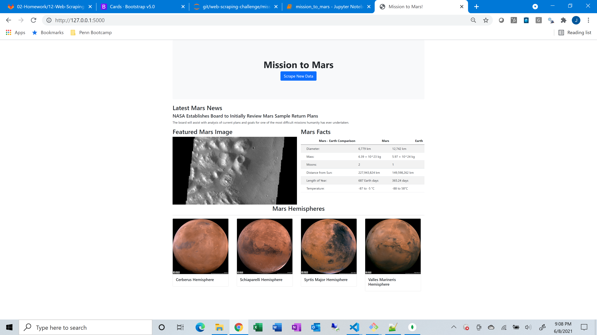

# web-scraping-challenge

This repository contains a *jupyter notebook* and a *flask application* that perform web scraping operations. Data pulled down from the web include articles, images, and data tables related to Mars. After performing the scraping, data pulled down is stored in a MongoDB which is used as a back end for the *flask* application. The web scraping operations performed using *splinter* and *BeautifulSoup*, and are as follows:

* From the [Mars News Site](https://redplanetscience.com/), scrape the latest news article title and article summary
* From the [Featured Space Image Site](https://spaceimages-mars.com/), scrape the featured image from this site
* From the [Mars Facts Site](https://galaxyfacts-mars.com/), scrape a table comparing mars facts vs. earth
* From the [Mars Hemisphere Site](https://marshemispheres.com/), scrape the full resolution hemisphere images 

In addition to the jupyter notebook, a supplemental file called *scrape_mars.py* is used to scrape these different sites on demand when pressing the "Scrape New Data" button in the flask html template. A sample of what the application looks like in the browser is below:

Note also the *Bootstrap* framework was used in front end layout development.
  
